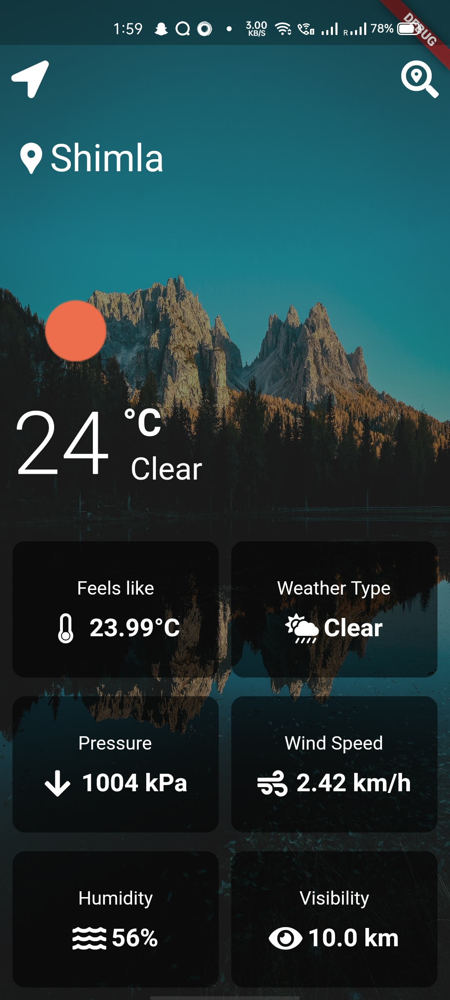
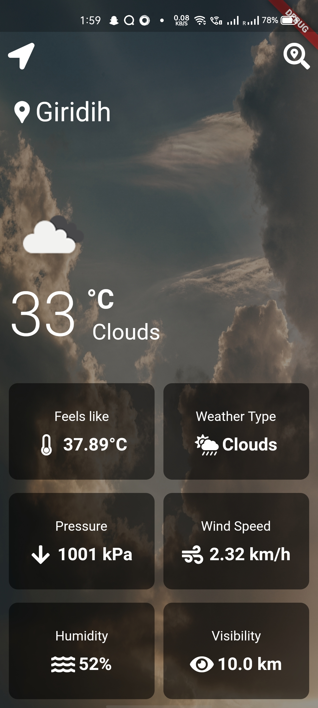
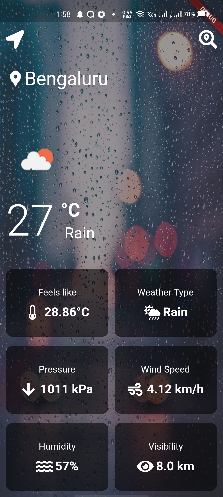
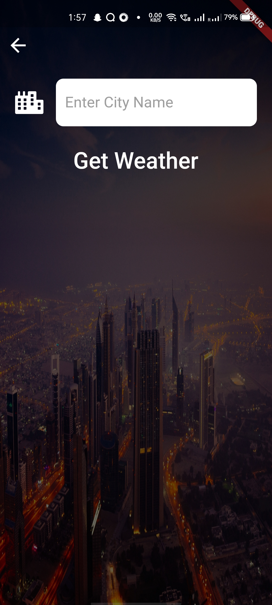

# Weather App

A flutter application to check on the weather of your current location or the location you are interested in.

## Features:
1. Opens with an animation by [flutter_spinkit ](https://pub.dev/packages/flutter_spinkit).
2. Will detect the your location as soon as you open the open the application and navigates you to the weather display page.
3. The weather display page shows the current temperature at your location, the weather type, pressure, humidity and other related information.
4. The background shows the image related to the current weather type of the location.
5. Has a search button at the top that navigates to the search page where you can search the city you want to know the location of.
6. Has a navigation button that directs you to the back to show the weather of your current location after you look up other locations.

## ScreenShots:

**API USED:** [OpenWeatherMap](https://openweathermap.org/)

